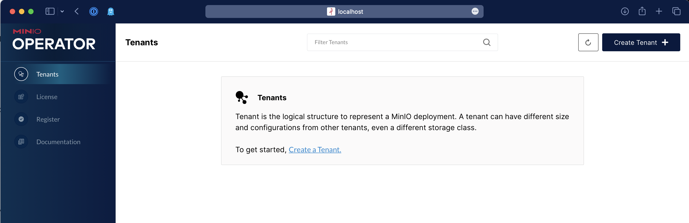

# MinIO Operator
 

[](https://min.io)

MinIO is a Kubernetes-native high performance object store with an S3-compatible API. The
MinIO Kubernetes Operator supports deploying MinIO Tenants onto private and public
cloud infrastructures ("Hybrid" Cloud).

This README provides a high level description of the MinIO Operator and 
quickstart instructions. See https://docs.min.io/minio/k8s/ for 
complete documentation on the MinIO Operator.

## Table of Contents

* [Architecture](#architecture)
  * [MinIO Console](#minio-console)
  * [MinIO Operator and `kubectl` Plugin](#minio-operator-and-kubectl-plugin)
* [Deploy the MinIO Operator and Create a Tenant](#deploy-the-minio-operator-and-create-a-tenant)
  * [Prerequisites](#prerequisites)
  * [Procedure](#procedure)

# Architecture

Each MinIO Tenant represents an independent MinIO Object Store within
the Kubernetes cluster. The following diagram describes the architecture of a
MinIO Tenant deployed into Kubernetes:


MinIO provides multiple methods for accessing and managing the MinIO Tenant:

## MinIO Console

The MinIO Console provides a graphical user interface (GUI) for interacting with
MinIO Tenants. The MinIO Operator installs and configures the Console for each
tenant by default.


Administrators of MinIO Tenants can perform a variety of tasks through the Console,
including user creation, policy configuration, and bucket replication. The
Console also provides a high level view of Tenant health, usage, and healing
status.

For more complete documentation on using the MinIO Console, see the
[MinIO Console Github Repository](https://github.com/minio/console).

## MinIO Operator and `kubectl` Plugin

The MinIO Operator extends the Kubernetes API to support deploying MinIO-specific
resources as a Tenant in a Kubernetes cluster.

The MinIO `kubectl minio` plugin wraps the Operator to provide a simplified interface
for deploying and managing MinIO Tenants in a Kubernetes cluster through the
`kubectl` command line tool.

# Deploy the MinIO Operator and Create a Tenant

This procedure installs the MinIO Operator and creates a 4-node MinIO Tenant for supporting object storage operations in a Kubernetes cluster.

## Prerequisites

### Kubernetes 1.19 or Later

Starting with Operator v4.0.0, MinIO requires Kubernetes version 1.19.0 or later. Previous versions of the Operator supported    Kubernetes 1.17.0 or later. You must upgrade your Kubernetes cluster to 1.19.0 or later to use Operator v4.0.0+.

This procedure assumes the host machine has [`kubectl`](https://kubernetes.io/docs/tasks/tools) installed and configured with access to the target Kubernetes cluster.

### MinIO Tenant Namespace

MinIO supports no more than *one* MinIO Tenant per Namespace. The following `kubectl` command creates a new namespace for the MinIO Tenant.

```sh
kubectl create namespace minio-tenant-1
```

The MinIO Operator Console supports creating a namespace as part of the Tenant Creation procedure.

### Tenant Storage Class

The MinIO Kubernetes Operator automatically generates Persistent Volume Claims (`PVC`) as part of deploying a MinIO Tenant.

The plugin defaults to creating each `PVC` with the `default` Kubernetes [`Storage Class`](https://kubernetes.io/docs/concepts/storage/storage-classes/). If the `default` storage class cannot support the generated `PVC`, the tenant may fail to deploy.

MinIO Tenants *require* that the `StorageClass` sets `volumeBindingMode` to `WaitForFirstConsumer`. The default `StorageClass` may use the `Immediate` setting, which can cause complications during `PVC` binding. MinIO strongly recommends creating a custom `StorageClass` for use by `PV` supporting a MinIO Tenant.

The following `StorageClass` object contains the appropriate fields for supporting a MinIO Tenant using
[MinIO DirectCSI-managed drives](https://github.com/minio/direct-csi):

```yaml
apiVersion: storage.k8s.io/v1
kind: StorageClass
metadata:
    name: direct-csi-min-io
provisioner: kubernetes.io/no-provisioner
volumeBindingMode: WaitForFirstConsumer
```

### Tenant Persistent Volumes

The MinIO Operator generates one Persistent Volume Claim (PVC) for each volume in the tenant *plus* two PVC to support collecting Tenant Metrics and logs. The cluster *must* have sufficient [Persistent Volumes](https://kubernetes.io/docs/concepts/storage/persistent-volumes/) that meet the capacity requirements of each PVC for the tenant to start correctly. For example, deploying a Tenant with 16 volumes requires 18 (16 + 2). If each PVC requests 1TB capacity, then each PV must also provide *at least* 1TB of capacity. 

MinIO recommends using the [MinIO DirectCSI Driver](https://github.com/minio/direct-csi) to automatically provision Persistent Volumes from locally attached drives. This procedure assumes MinIO DirectCSI is installed and configured.

For clusters which cannot deploy MinIO DirectCSI, use [Local Persistent Volumes](https://kubernetes.io/docs/concepts/storage/volumes/#local). The following example YAML describes a local persistent volume:

The following YAML describes a `local` PV:

```yaml
apiVersion: v1
kind: PersistentVolume
metadata:
   name: <PV-NAME>
spec:
   capacity:
      storage: 1Ti
   volumeMode: Filesystem
   accessModes:
   - ReadWriteOnce
   persistentVolumeReclaimPolicy: Retain
   storageClassName: local-storage
   local:
      path: </mnt/disks/ssd1>
   nodeAffinity:
      required:
         nodeSelectorTerms:
         - matchExpressions:
            - key: kubernetes.io/hostname
              operator: In
              values:
              - <NODE-NAME>
```

Replace values in brackets `<VALUE>` with the appropriate value for the local drive.

You can estimate the number of PVC by multiplying the number of `minio` server pods in the Tenant by the number of drives per node. For example, a 4-node Tenant with 4 drives per node requires 16 PVC and therefore 16 PV.

MinIO *strongly recommends* using the following CSI drivers for creating local PV to ensure best object storage performance:

- [MinIO DirectCSI](https://github.com/minio/direct-csi)
- [Local Persistent Volume](https://kubernetes.io/docs/concepts/storage/volumes/#local)

## Procedure
  
### 1) Install the MinIO Operator

Run the following commands to install the MinIO Operator and Plugin using the Kubernetes ``krew`` plugin manager:

```sh
kubectl krew update
kubectl krew install minio
```
   
See the ``krew`` [installation documentation](https://krew.sigs.k8s.io/docs/user-guide/setup/install/) for instructions on installing ``krew``.
   
Run the following command to verify installation of the plugin:

```sh
kubectl minio version
```

As an alternative to `krew`, you can download the `kubectl-minio` plugin from the [Operator Releases Page](https://github.com/minio/operator/releases).  Download the `kubectl-minio` package appropriate for your operating system and extract the contents as `kubectl-minio`. Set the `kubectl-minio` binary to be executable (e.g. `chmod +x`) and place it in your system `PATH`.

For example, the following code downloads the latest stable version of the MinIO Kubernetes Plugin and installs it to the system ``$PATH``. The example assumes a Linux operating system:

```sh
wget -qO- https://github.com/minio/operator/releases/latest/download/kubectl-minio_linux_amd64.zip | sudo bsdtar -xvf- -C /usr/local/bin
sudo chmod +x /usr/local/bin/kubectl-minio
```

Run the following command to verify installation of the plugin:
```sh
kubectl minio version
```

Run the following command to initialize the Operator:
```sh
kubectl minio init
```

Run the following command to verify the status of the Operator:

```sh
kubectl get pods -n minio-operator
```

The output resembles the following:

```sh
NAME                              READY   STATUS    RESTARTS   AGE
console-6b6cf8946c-9cj25          1/1     Running   0          99s
minio-operator-69fd675557-lsrqg   1/1     Running   0          99s
```

The `console-*` pod runs the MinIO Operator Console, a graphical user
interface for creating and managing MinIO Tenants.

The `minio-operator-*` pod runs the MinIO Operator itself.

### 2) Access the Operator Console

Run the following command to create a local proxy to the MinIO Operator
Console:

```sh
kubectl minio proxy -n minio-operator
```

The output resembles the following:

```sh
kubectl minio proxy
Starting port forward of the Console UI.

To connect open a browser and go to http://localhost:9090

Current JWT to login: TOKENSTRING
```

Open your browser to the provided address and use the JWT token to log in
to the Operator Console.



Click **+ Create Tenant** to open the Tenant Creation workflow.

### 3) Build the Tenant Configuration

The Operator Console **Create New Tenant** walkthrough builds out
a MinIO Tenant. The following list describes the basic configuration sections.

- **Name** - Specify the *Name*, *Namespace*, and *Storage Class* for the new Tenant. 
  
  The *Storage Class* must correspond to a [Storage Class](#default-storage-class) that corresponds to [Local Persistent Volumes](#local-persistent-volumes) that can support the MinIO Tenant.
  
  The *Namespace* must correspond to an existing [Namespace](#minio-tenant-namespace) that does *not* contain any other MinIO Tenant.
  
  Enable *Advanced Mode* to access additional advanced configuration options. 
  
- **Tenant Size** - Specify the *Number of Servers*, *Number of Drives per Server*, and *Total Size* of the Tenant. 

   The *Resource Allocation* section summarizes the Tenant configuration
   based on the inputs above.
   
   Additional configuration inputs may be visible if *Advanced Mode* was enabled
   in the previous step.
   
- **Preview Configuration** - summarizes the details of the new Tenant.

After configuring the Tenant to your requirements, click **Create** to create the new tenant.

The Operator Console displays credentials for connecting to the MinIO Tenant. You *must* download and secure these credentials at this stage. You cannot trivially retrieve these credentials later.

You can monitor Tenant creation from the Operator Console.

### 4) Connect to the Tenant

Use the following command to list the services created by the MinIO
Operator:

```sh
kubectl get svc -n NAMESPACE
```

Replace `NAMESPACE` with the namespace for the MinIO Tenant. The output
resembles the following:

```sh
NAME                             TYPE            CLUSTER-IP        EXTERNAL-IP   PORT(S)      
minio                            LoadBalancer    10.104.10.9       <pending>     443:31834/TCP
minio-tenant-1-console           LoadBalancer    10.104.216.5      <pending>     9443:31425/TCP
minio-tenant-1-hl                ClusterIP       None              <none>        9000/TCP
minio-tenant-1-log-hl-svc        ClusterIP       None              <none>        5432/TCP
minio-tenant-1-log-search-api    ClusterIP       10.102.151.239    <none>        8080/TCP
minio-tenant-1-prometheus-hl-svc ClusterIP       None              <none>        9090/TCP
```

Applications *internal* to the Kubernetes cluster should use the `minio` service for performing object storage operations on the Tenant.

Administrators of the Tenant should use the `minio-tenant-1-console` service to access the MinIO Console and manage the Tenant, such as provisioning users, groups, and policies for the Tenant.

MinIO Tenants deploy with TLS enabled by default, where the MinIO Operator uses the
Kubernetes `certificates.k8s.io` API to generate the required x.509 certificates. Each
certificate is signed using the Kubernetes Certificate Authority (CA) configured during
cluster deployment. While Kubernetes mounts this CA on Pods in the cluster, Pods do
*not* trust that CA by default. You must copy the CA to a directory such that the
`update-ca-certificates` utility can find and add it to the system trust store to
enable validation of MinIO TLS certificates:

```sh

cp /var/run/secrets/kubernetes.io/serviceaccount/ca.crt /usr/local/share/ca-certificates/
update-ca-certificates
```

For applications *external* to the Kubernetes cluster, you must configure
[Ingress](https://kubernetes.io/docs/concepts/services-networking/ingress/) or a
[Load Balancer](https://kubernetes.io/docs/concepts/services-networking/service/#loadbalancer) to
expose the MinIO Tenant services. Alternatively, you can use the `kubectl port-forward` command
to temporarily forward traffic from the local host to the MinIO Tenant.


# License

Use of MinIO Operator is governed by the GNU AGPLv3 or later, found in the [LICENSE](./LICENSE) file.

# Explore Further

[MinIO Hybrid Cloud Storage Documentation](https://docs.min.io/minio/k8s/index.html)
- [Deploy MinIO Operator on Kubernetes](https://docs.min.io/minio/k8s/deployment/deploy-minio-operator.html)
- [Deploy a MinIO Tenant using the MinIO Plugin](https://docs.min.io/minio/k8s/tenant-management/deploy-minio-tenant.html)
- [Configure TLS/SSL for MinIO Tenants](https://docs.min.io/minio/k8s/tutorials/transport-layer-security.html)

[Github Resources](https://github.com/minio/operator/blob/master/docs/)
- [Examples for MinIO Tenant Settings](https://github.com/minio/operator/blob/master/docs/examples.md)
- [Custom Hostname Discovery](https://github.com/minio/operator/blob/master/docs/custom-name-templates.md).
- [Apply PodSecurityPolicy](https://github.com/minio/operator/blob/master/docs/pod-security-policy.md).
- [Deploy MinIO Tenant with Console](https://github.com/minio/operator/blob/master/docs/console.md).
- [Deploy MinIO Tenant with KES](https://github.com/minio/operator/blob/master/docs/kes.md).
- [Tenant API Documentation](docs/crd.adoc)
