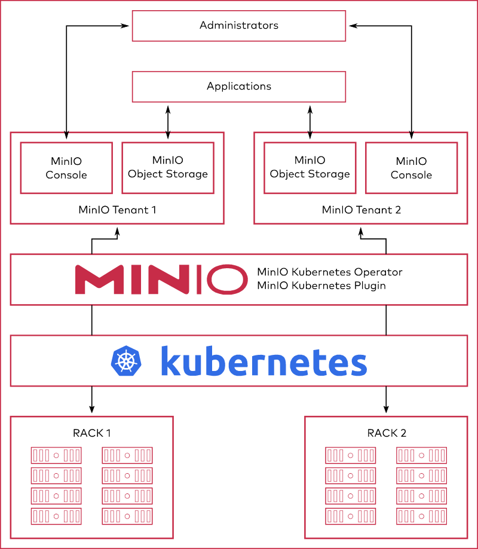

# MinIO Operator

 

<a href="https://min.io">  </a>

MinIO is a Kubernetes-native high performance object store with an S3-compatible API. The 
MinIO Kubernetes Operator supports deploying MinIO Tenants onto private and public 
cloud infrastructures ("Hybrid" Cloud).

*IMPORTANT*: This documentation reflects the *latest bleeding-edge release* of the MinIO Operator. The API and syntax may differ from
previous releases. For documentation on previous releases, please visit the documentation in context of that release tag:

- [v0.3.29](https://github.com/minio/operator/blob/v3.0.29/README.md)
- [v0.3.28](https://github.com/minio/operator/blob/v3.0.28/README.md)

## Table of Contents

* [Architecture](#architecture)
  * [MinIO Console](#minio-console)
  * [MinIO Operator and `kubectl` Plugin](#minio-operator-and-kubectl-plugin)
* [Create a MinIO Tenant](#create-a-minio-tenant)
* [Expand a MinIO Tenant](#expand-a-minio-tenant)
* [Kubernetes Cluster Configuration](#kubernetes-cluster-configuration)
  * [Default Storage Class](#default-storage-class)
  * [Local Persistent Volumes](#local-persistent-volumes)
  * [MinIO Tenant Namespace](#minio-tenant-namespace)

# Architecture

Each MinIO Tenant represents an independent MinIO Object Store within
the Kubernetes cluster. The following diagram describes the architecture of a
MinIO Tenant deployed into Kubernetes:



MinIO provides multiple methods for accessing and managing the MinIO Tenant:

## MinIO Console

The MinIO Console provides a graphical user interface (GUI) for interacting with
MinIO Tenants. 


Administrators of MinIO Tenants can perform a variety of tasks through the Console,
including user creation, policy configuration, and bucket replication. The
Console also provides a high level view of Tenant health, usage, and healing
status.

For more complete documentation on using the MinIO Console, see the 
[MinIO Console Github Repository](https://github.com/minio/console).

## MinIO Operator and `kubectl` Plugin

The MinIO Operator extends the Kubernetes API to support deploying MinIO-specific
resources as a Tenant in a Kubernetes cluster.

The MinIO `kubectl minio` plugin wraps the Operator to provide a simplified interface
for deploying and managing MinIO Tenants in a Kubernetes cluster through the
`kubectl` command line tool.

# Create a MinIO Tenant

This procedure creates a 4-node MinIO Tenant suitable for evaluation and 
early development using MinIO for object storage.

## Prerequisites

- MinIO requires Kubernetes version 1.17.0 or later.

- This procedure assumes the cluster contains a 
  [namespace](https://github.com/minio/operator/blob/master/README.md#minio-tenant-namespace) for
  the MinIO Tenant.

- This procedure assumes the cluster contains a
  [`StorageClass`](https://github.com/minio/operator/blob/master/README.md#default-storage-class)
  for the MinIO Tenant Persistent Volumes  (`PV`). The `StorageClass`
  *must* have `volumeBindingMode: WaitForFirstConsumer`

- This procedure uses the [Kubernetes `krew`](https://github.com/kubernetes-sigs/krew)
  plugin manager. See the 
  [`krew` installation documentation](https://krew.sigs.k8s.io/docs/user-guide/setup/install/).

## 1) Install the MinIO Operator

### Install using `kubectl krew`

Run the following command to install the MinIO Operator and Plugin using `krew`:

```sh
   kubectl krew update
   kubectl krew install minio
```

Run the following command to initialize the Operator:

```sh
kubectl minio init

```

## 2) Create a New Tenant

The following `kubectl minio` command creates a MinIO Tenant with 4 nodes, 16
volumes, and a total capacity  of 16Ti. This configuration requires
*at least* 16 
[Persistent Volumes](https://github.com/minio/operator#Local-Persistent-Volumes).

```sh
   kubectl minio tenant create minio-tenant-1 \
      --servers 4                             \
      --volumes 16                            \
      --capacity 16Ti                         \
      --namespace minio-tenant-1              \
      --storage-class local-storage        \
```

- The `minio-tenant-1` argument specifies the name of the MinIO Tenant. The MinIO
  Operator uses this name as a prefix for certain resources in the Tenant.

- The `--servers` field indicates the number of `minio` pods to deploy into the cluster.
  The cluster *must* have at least one available worker Node per `minio` pod. 

- The `--volumes` field indicates the total number of volumes in the Tenant. MinIO
  generates a Persistent Volume Claim (`PVC`) for each volume and evenly distributes
  volumes across each `minio` pod. The example above results in 4 volumes per `minio` pod.

  Tenant creation hangs if the Kubernetes cluster does not have at least one 
  unbound Persistent Volume (`PV`) for each generated `PVC`.

- The `--capacity` field indicates the total capacity of the cluster. MinIO determines the
  amount of storage to request for each `pvc` by dividing the specified capacity by the
  total number of volumes in the server. The example above results in 1Ti requested
  capacity per volume.

  Tenant creation hangs if the Kubernetes cluster does not have at least one 
  Persistent Volume (`PV`) with sufficient capacity to bind to each generated `PVC`.

- The `--namespace` field indicates the namespace onto which MinIO deploys the Tenant. 
  If omitted, MinIO uses the `Default` namespace.

  MinIO supports *one* MinIO Tenant per namespace.

- The `--storage-class` field indicates which 
  [`StorageClass`](https://kubernetes.io/docs/concepts/storage/storage-classes/) to use 
  when generating each `PVC`.

## 3) Connect to the Tenant

MinIO outputs credentials for connecting to the MinIO Tenant as part of the creation
process:

```sh

Tenant 'minio-tenant-1' created in 'minio-tenant-1' Namespace
  Username: admin 
  Password: dbc978c2-bfbe-41bf-9dc6-699c76bafcd0 
+-------------+------------------------+------------------+--------------+-----------------+
| APPLICATION |      SERVICE NAME      |     NAMESPACE    | SERVICE TYPE | SERVICE PORT(S) |
+-------------+------------------------+------------------+--------------+-----------------+
| MinIO       | minio                  | minio-tenant-1   | ClusterIP    | 443             |
| Console     | minio-tenant-1-console | minio-tenant-1   | ClusterIP    | 9090,9443       |
+-------------+------------------------+------------------+--------------+-----------------+

```

Copy the credentials to a secure location, such as a password protected key manager. 
MinIO does *not* display these credentials again.

MinIO Tenants deploy with TLS enabled by default, where the MinIO Operator uses the 
Kubernetes `certificates.k8s.io` API to generate the required x.509 certificates. Each 
certificate is signed using the Kubernetes Certificate Authority (CA) configured during
cluster deployment. While Kubernetes mounts this CA on Pods in the cluster, Pods do 
*not* trust that CA by default. You must copy the CA to a directory such that the 
`update-ca-certificates` utility can find and add it to the system trust store to 
enable validation of MinIO TLS certificates:

```sh

cp /var/run/secrets/kubernetes.io/serviceaccount/ca.crt /usr/local/share/ca-certificates/
update-ca-certificates
```

For applications *external* to the Kubernetes cluster, you must configure 
[Ingress](https://kubernetes.io/docs/concepts/services-networking/ingress/) or a
[Load Balancer](https://kubernetes.io/docs/concepts/services-networking/service/#loadbalancer) to
expose the MinIO Tenant services. Alternatively, you can use the `kubectl port-forward` command 
to temporarily forward traffic from the local host to the MinIO Tenant. 

- The `minio` service provides access to MinIO Object Storage operations.

- The `minio-tenant-1-console` service provides access to the MinIO Console. The 
  MinIO Console supports GUI administration of the MinIO Tenant.

# Expand a MinIO Tenant

MinIO supports expanding an existing MinIO Tenant onto additional hosts and storage.

- MinIO requires Kubernetes version 1.17.0 or later.

- This procedure assumes the cluster contains a 
  [namespace](https://github.com/minio/operator#create-a-namespace) for
  the MinIO Tenant.

The following `kubectl minio` command expands a MinIO Tenant with an additional
4 `minio` pods, 16 volumes, and added capacity of 16Ti:

```sh

   kubectl minio tenant expand minio-tenant-1 \
      --servers 4                             \
      --volumes 16                            \
      --capacity 16Ti

```

- The `minio-tenant-1` argument specifies the name of the existing MinIO Tenant to expand.

- The `--servers` field indicates the number of `minio` pods to deploy into the cluster.
  The cluster *must* have at least one available worker Node per `minio` pod. 

- The `--volumes` field indicates the total number of volumes in the Tenant. MinIO
  generates a Persistent Volume Claim (`PVC`) for each volume and evenly distributes
  volumes across each `minio` pod. The example above results in 4 volumes per `minio` pod.

  Tenant expansion hangs if the Kubernetes cluster does not have at least one 
  unbound Persistent Volume (`PV`) for each generated `PVC`.

- The `--capacity` field indicates the total capacity of the cluster. MinIO determines the
  amount of storage to request for each `pvc` by dividing the specified capacity by the
  total number of volumes in the server. The example above results in 1Ti requested
  capacity per volume.

  Tenant expansion hangs if the Kubernetes cluster does not have at least one unbound
  Persistent Volume (`PV`) for each generated `PVC`.


# Kubernetes Cluster Configuration

## Default Storage Class

The MinIO Kubernetes Plugin (`kubectl minio`) automatically generates
Persistent Volume Claims (`PVC`) as part of deploying a MinIO Tenant. 
The plugin defaults to creating each `PVC` with the `default`
Kubernetes [`Storage Class`](https://kubernetes.io/docs/concepts/storage/storage-classes/).

MinIO Tenants *require* that the `StorageClass` set 
`volumeBindingMode` to `WaitForFirstConsumer`. The default `StorageClass` may use the 
`Immediate` setting, which can cause complications during `PVC` binding. MinIO 
strongly recommends creating a custom `StorageClass` for use by 
`PV` supporting a MinIO Tenant:


The following `StorageClass` object contains the appropriate fields for use with the MinIO Plugin:

```yaml
apiVersion: storage.k8s.io/v1
kind: StorageClass
metadata:
    name: local-storage
provisioner: kubernetes.io/no-provisioner
volumeBindingMode: WaitForFirstConsumer
```

To specify the storage class, include the `--storage-class` option to 
`kubectl minio tenant create`.


## Local Persistent Volumes

MinIO automatically creates Persistent Volume Claims (PVC) as part of Tenant creation.
Ensure the cluster has at least one 
[Persistent Volume](https://kubernetes.io/docs/concepts/storage/persistent-volumes/)
for each PVC MinIO requests.

You can estimate the number of PVC by multiplying the number of `minio` server pods in the 
Tenant by the number of drives per node. For example, a 4-node Tenant with
4 drives per node requires 16 PVC and therefore 16 PV.

MinIO *strongly recommends* using the following CSI drivers for
creating local PV to ensure best object storage performance:

- [Local Persistent Volume](https://kubernetes.io/docs/concepts/storage/volumes/#local)
- [OpenEBS Local PV](https://docs.openebs.io/docs/next/localpv.html)

## MinIO Tenant Namespace

MinIO supports no more than *one* MinIO Tenant per Namespace. The following
`kubectl` command creates a new namespace for the MinIO Tenant.

```sh
kubectl create namespace minio-tenant-1
```

# License

Use of MinIO Operator is governed by the GNU AGPLv3 or later, found in the [LICENSE](./LICENSE) file.

# Explore Further

- [Create a MinIO Tenant](https://github.com/minio/operator#create-a-minio-instance).
- [TLS for MinIO Tenant](https://github.com/minio/operator/blob/master/docs/tls.md).
- [Examples for MinIO Tenant Settings](https://github.com/minio/operator/blob/master/docs/examples.md)
- [Custom Hostname Discovery](https://github.com/minio/operator/blob/master/docs/custom-name-templates.md).
- [Apply PodSecurityPolicy](https://github.com/minio/operator/blob/master/docs/pod-security-policy.md).
- [Deploy MinIO Tenant with Console](https://github.com/minio/operator/blob/master/docs/console.md).
- [Deploy MinIO Tenant with KES](https://github.com/minio/operator/blob/master/docs/kes.md).
