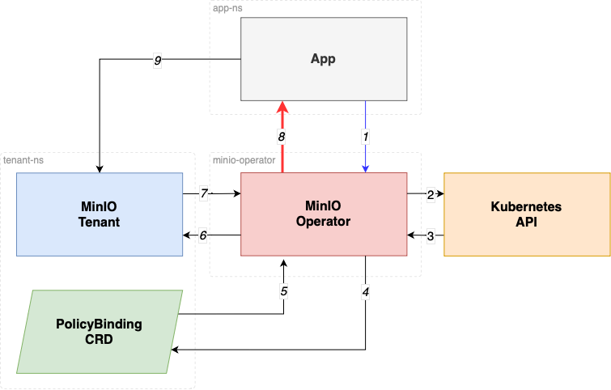

# MinIO Operator STS

**Native IAM Authentication for Kubernetes.**

> ⚠️ This feature is an alpha release and is subject to breaking changes in future releases.

MinIO Operator offers support
for [Secure Tokens](https://min.io/docs/minio/linux/developers/security-token-service.html?ref=op-gh) (a.k.a. STS) which
are a
form of temporary access credentials for your
MinIO Tenant. In essence, this allows you to control access to your MinIO tenant from your applications without having to
explicitly create credentials for each application; in fact no credentials need to be created at all.

# Authorization Flow

For an application to gain access into a MinIO Tenant, a `PolicyBinding` granting explicit access to the application's
[Service Account](https://kubernetes.io/docs/concepts/security/service-accounts/). Authorization is then validated
using the following steps:

1. AssumeRoleWithWebIdentity call
2. Verify ServiceAccount JWT
3. JWT Validation Result
4. Validate SA has PolicyBinding in the Tenant namespace
5. Get PolicyBinding
6. AssumeRole for application
7. Obtain Temporary Credentials
8. Return Temporary Credentials To App
9. Consume Object Storage

# Requirements

## Enabling STS functionality

Operator STS was first introduced on v5.0.0, by default turned off, starting Operator v5.0.11 the STS feature ships `on` by default. 
On versions > 5.0.0 and < 5.0.11 to turn it on, switch `OPERATOR_STS_ENABLED` to `on` in the `minio-operator` deployment.

## TLS

The STS functionality works only with TLS configured. We can request certificates automatically, but additionally you can
use `cert-manager` or bring your own certificates.

## SDK support

Your application must use an SDK that supports `AssumeRole` like behavior.

# Examples

We have provided example usage in the [examples/kustomization/sts-example](../examples/kustomization/sts-example)
folder.
