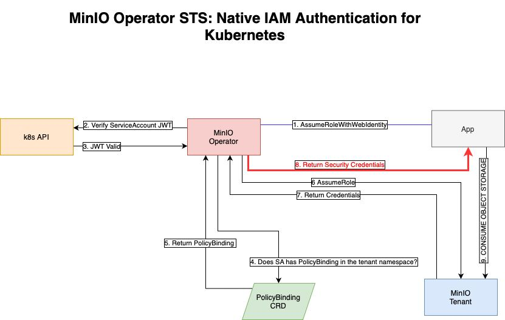

# MinIO Operator STS

**Native IAM Authentication for Kubernetes.**

> ⚠️ This feature is an alpha release and is subject to breaking changes in future releases.

MinIO Operator offer support for the STS paradigm for workload identify.

# Requirements

## TLS

The STS functionality works only with TLS configured. We can request certificates automatically, but additional you can
user `cert-manager` or bring your own certificates.

## SDK support

Your application must use an SDK that supports `AssumeRole` like behavior.