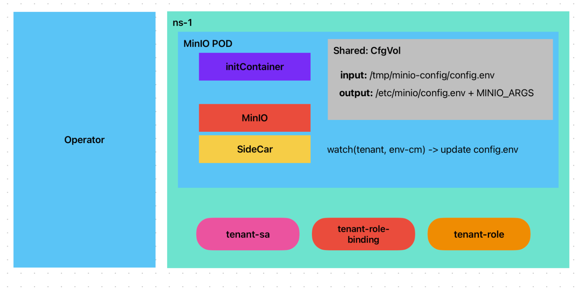
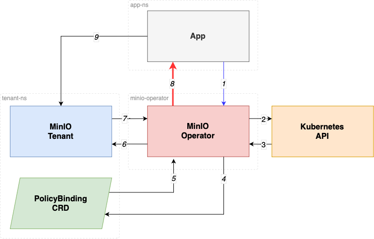
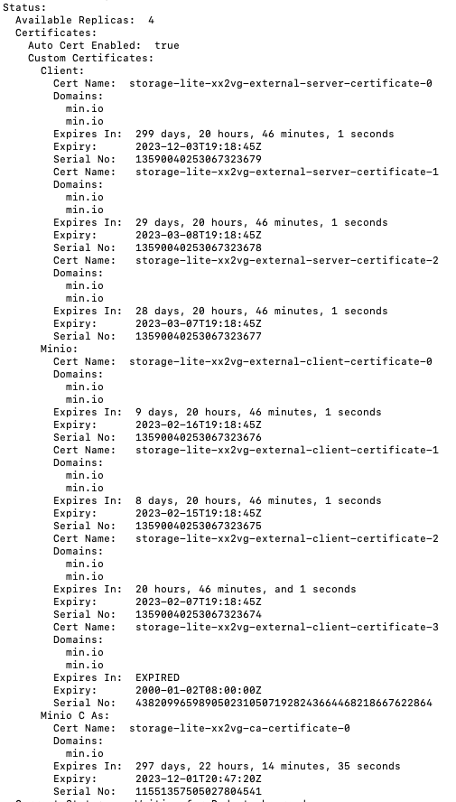
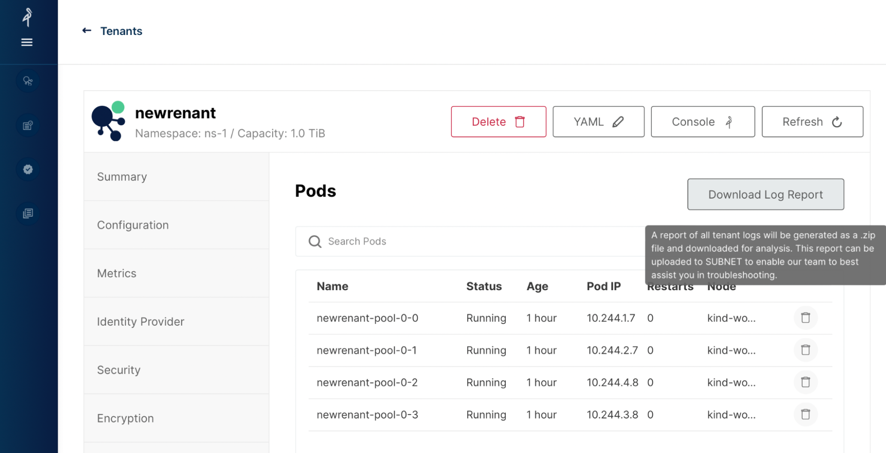

# MinIO Operator v5.0.0 release notes

## About this release

MinIO Operator is the production-ready easiest way to manage MinIO deployments in kubernetes. And with a new version, new features, a lot of bug fixes, new kubernetes base version requirements, deprecations and much more.

## What’s new?

Operator 5.0.0 is now available, this release requires Kubernetes version 1.21.0 or later, you must upgrade your Kubernetes cluster to 1.21.0 or later to use Operator v5.0.0+.

Helm Operator chart image is now pointing to _quay.io/minio/operator_ container registry

Hem Tenant chart image is now pointing to _quay.io/minio/minio_ container registry

Examples got better:


* Added [KES with cert-manager](https://github.com/minio/operator/tree/master/examples/kustomization/tenant-certmanager-kes) example
* Added [GCP fleet workload identity in KES](https://github.com/minio/operator/tree/master/examples/kustomization/tenant-kes-encryption-gcp) example
* Refactored examples to simplify testing

Docs got better:


* Added [passing custom certs/CAs to Operator](https://github.com/minio/operator/blob/master/docs/operator-tls.md) doc
* Added [Operator environment variables](https://github.com/minio/operator/blob/master/docs/env-variables.md) doc
* Added [Operator STS](https://github.com/minio/operator/blob/master/docs/STS.md) doc

A lot of bug fixes, please refer to the github [release changelog](https://github.com/minio/operator/releases) for a full list.


# New Features

This release adds improvements to the management of MinIO clusters (AKA: Tenants) in kubernetes, resulting from a series of substantial refactors that will reduce dependencies, increase fail toleration and enhance compatibility with public and private clouds like OpenShift.

Also introduces new features like enhanced visibility for TLS certificates, Openshift support, GCP fleet workload identity in KES, and Operator STS: a v1beta1 proposal for kubernetes native authentication.


## Introducing sidecar operator pod



Operator sidecar pod in the Tenant removes dependency from the Tenant pods to Operator during startup, Now if Operator service fails or goes down, tenants can keep running on their own meanwhile Operator comes back.

On previous Operator releases, Tenants relied on communicating with Operator to get the initial minio server startup arguments, this could under very specific scenarios hinder the Tenants restart, ie: the call MinIO did to Operator was to an http webhook server (and by default an https endpoint) if operator service is down or the TLS certificate expired, that could prevent Tenants from restart due to be unable of communicate with Operator pod.

Moves the Bucket DNS webhook from Operator to the sidecar along with the Tenant, no longer needing a tenant to reach to operator for Bucket Service creation.


## Introducing Operator STS: Native IAM Authentication for Kubernetes.

We are excited to share that MinIO Operator offers support for Secure Tokens (a.k.a. STS)!

STS Tokens are a form of temporary access credentials for your MinIO Tenant, in essence, this allows you to control access to your MinIO tenant from kubernetes without having to explicitly create credentials for each application; in fact no credentials need to be created at all!The whole purpose is to provide a kubernetes native credentialless authentication method for workloads.


### Authorization Flow

For an application to gain access into a MinIO Tenant, a PolicyBinding (new!) kubernetes resource grants explicit access to a kubernetes application's [Service Account](https://kubernetes.io/docs/concepts/security/service-accounts/). Authorization is then validated using the following steps:


1. AssumeRoleWithWebIdentity call
2. Verify ServiceAccount JWT
3. JWT Validation Result
4. Validate SA has PolicyBinding in the Tenant namespace
5. Get PolicyBinding
6. AssumeRole for application
7. Obtain Temporary Credentials
8. Return Temporary Credentials To App
9. Consume Object Storage





This feature is **v1beta1** and subject to changes, [STS documentation](https://github.com/minio/operator/blob/master/docs/STS.md) is provided, please look at the client code examples in the [examples/kustomization/sts-example](https://github.com/minio/operator/tree/master/examples/kustomization/sts-example) directory for your favorite programming language, MinIO SDK and AWS SDK examples are provided.


## New home for Operator Console codebase

Operator console code is now part of the [minio/operator](https://github.com/minio/operator) code base, console now it’s built in the same operator binary, this comes with some great benefits:


* Removes dependency on [minio/console](https://github.com/minio/console) repository
* Operator is now shipped in a single container minio/operator:v5.0.0 this will reduce the amount of binaries and container repositories that need to be scanned for security vulnerabilities and maintained down in air-gapped environments.
* The minio/console codebase is now smaller and as collateral, the [minio/minio](https://github.com/minio/minioio) binary as well.


## Enhanced TLS certificates details and expiration

We are now including a section in the **status** section of the Tenant resource with many handful details that will simplify the day 2 TLS certificate operations:


```
kubectl describe tenant 
```




* List of custom certificates
* Certificate name
* Domains
* Expiration date
* Serial No
* Etc


The Tenant resource Events now will also warn when a certificate is about to expire.


```
kubectl describe tenant 
```


## Openshift support

On the Openshift front compatibility and support are present too.


### Openshift CSR signer Certificate Authority (CA)

MinIO Operator will include the CA certificate in the **_csr-signer_** secret under **openshift-kube-controller-manager-operator** namespace in the tenant TLS trust chain if the secret is present.

This will simplify the trust on the certificates that are issued for Tenants in the Openshift cluster.

Because the signer CA public certificate is not available by default in the pods, nor included in the certificates directory when MinIO server looks for certificates, this was one of the causes of this kind of error messages:


### No more hardcoded SecurityContext fields

Minio Operator  will no longer hardcode a fallback **_RunAsUser_**,**_ RunAsGroup_** and**_ RunAsNonRoot_** Pod Security Context values, this will let Openshift decide values to assign to the pods based on the Security Context Constraints (AKA: scc) in the OpenShift project.

Because these fields used to have a hardcoded fallback value, manual settings  and several workarounds were previously needed to set up tenants in Openshift.


## Tenant Log report

Adds a button on Pods Summary screen of Operator Console, which when clicked requests the server generate the Tenant Log Report, and if successfully generated, downloads the report.



## Add support for GCP fleet workload identity in KES

This allows KES to use the workload identity to communicate with the GCP secret store instead of managing and rotating the GCP service account.

This PR provides the support by mounting the default app credentials to the KES pods via k8s secret.

For more details in workload identity please refer to [Use workload Identity](https://cloud.google.com/anthos/fleet-management/docs/use-workload-identity)

You can find an example in the [operator/examples/kustomization/tenant-kes-encryption-gcp](https://github.com/minio/operator/tree/master/examples/kustomization/tenant-kes-encryption-gcp) directory, pleaselook in the release notes on [PR 1501](https://github.com/minio/operator/pull/1501) as well.


# Deprecations


## Logsearch API and Prometheus deployments deprecated

Both Log Search API (`.spec.log`) and Prometheus (`.spec.prometheus`) deployments were removed, and are no longer shipped as part of the MinIO Operator.

This does not break or remove support for metrics monitoring or access logs collection, this just means that the Operator is no longer responsible to install and manage such services.

Current users of included Prometheus deployment and Postgres + logsearch API however they will be left running as stand-alone deployments/statefulset with no connection to the Tenant CR itself if you upgrade to V5.0.0, this means that if the Tenant CR is deleted, this will not cascade to these deployments,

⚠️ It is recommended to create a yaml file to manage these deployments subsequently, follow the instructions in the [UPGRADE](https://github.com/minio/operator/blob/master/UPGRADE.md) guide.


## Tenant CRD V1 deprecated

It’s been quite some time since CRD v2 was introduced, and now is the baseline, tenant CRD V1 is removed.


## Conversion webhook is removed

A result of the deprecation of Tenant CRD V1, Operator is in no need to do CRD conversions.


## Operator API webhook is removed

As result of the refactor of Operator, the introduction of Operator sidecar


## Operator no longer need TLS certificate

With the removal of two of the web servers (conversion webhook and API), encrypted communication between outside actors to Operator is no longer a requirement, because TLS certificate for Operator is not needed, this simplifies the installation process in public and private cloud environments like Openshift, Amazon EKS, Azure AKS, etc.


## `.spec.S3` field removed

The `.spec.S3` field was removed in favor of `.spec.features`.


## `.spec.credsSecret` field removed

Field `.spec.credsSecret` was removed in favor of `.spec.configuration`, this secret should hold all the environment variables for the MinIO deployment that contain sensitive information and should not be shown on `.spec.env`.
